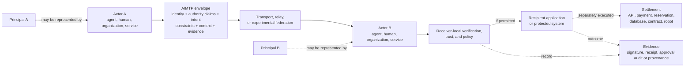
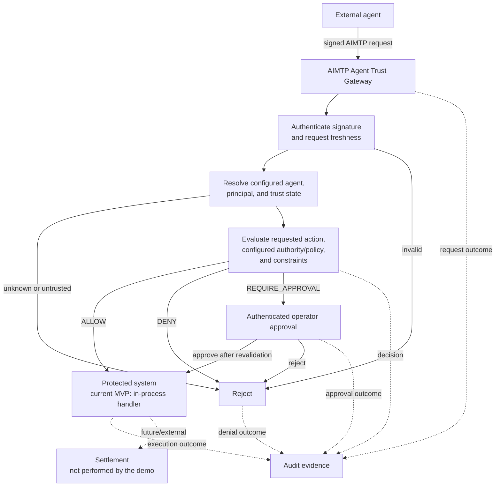
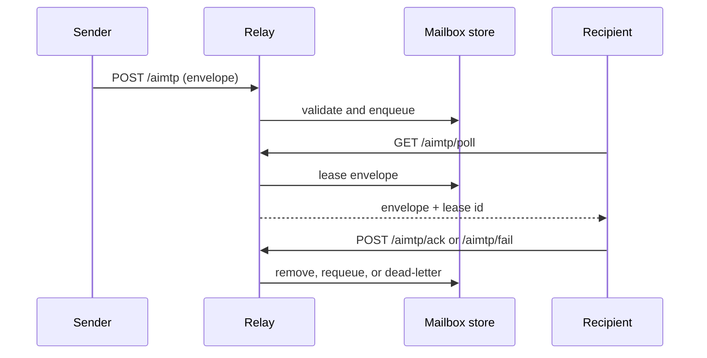

# AIMTP Architecture

- **Document authority:** Canonical
- **Product maturity:** Developer Preview
- **Last updated:** 2026-08-07

## Boundary model

The **Agentic Intelligent Message Transfer Protocol (AIMTP)** provides a trust
and authorization envelope between independent intelligent actors. It
separates three concerns:

1. **Envelope semantics:** identity claims, intent, capability hints,
   constraints, context, evidence, and extensible metadata.
2. **Decision and delivery infrastructure:** a Gateway may authorize an action;
   a relay or another transport may deliver an envelope.
3. **Settlement:** the protected system performs the real-world action after an
   authorization or agreement. Settlement is outside the base protocol.



The envelope can carry claims and supporting evidence; the receiver remains
responsible for verification and policy. A valid signature authenticates bytes
and a configured key, not the truth of every claim or permission for every
action.

## Conceptual layers

| Layer | Responsibility | Base `aimtp/0.1` representation |
| --- | --- | --- |
| Identity | Identify the actor and represented principal | `sender`, signature key identifier, extensible metadata |
| Authority | Describe or prove what the actor may do | No universal base object; capability profiles, metadata, and Gateway configuration provide current implementation paths |
| Intent | State the requested outcome | `intent`, `task`, and optional `actions` |
| Capability | Describe what a receiver offers or a request needs | Optional `capabilities`; experimental capability documents add enforcement semantics |
| Conversation | Maintain state across exchanges | Application-defined metadata such as a thread identifier; IntentOS supplies an optional projection |
| Trust | Establish confidence across keys, actors, and domains | Canonical signatures; opt-in federation, anchor, revocation, bundle, and bridge experiments |
| Policy and approval | Decide whether a request may proceed or needs human review | Not defined by the base protocol; receiver-local policy or the Gateway MVP provides current implementation paths |
| Evidence | Preserve support for decisions and outcomes | Signatures plus implementation-specific receipts, approvals, provenance, and audit events |
| Settlement | Perform the real-world action | Explicitly outside the base protocol |

This table is an architecture map, not a claim that the frozen schema already
defines every layer. In particular, principal representation and delegated
authority need implementation profiles or future versioned protocol work.
Canonical term definitions are maintained in [`GLOSSARY.md`](GLOSSARY.md).

## Agent Trust Gateway

The Gateway is the concrete authorization boundary in this repository.



Implemented Gateway decisions are `ALLOW`, `DENY`, and `REQUIRE_APPROVAL`.
Every accepted request is freshness-checked and registered against replay.
Approval revalidates identity, trust, and current policy before a single-claim
compare-and-swap executes the handler, so concurrent approvers cannot both
execute. Operator approvals and audit reads require a configured operator token.

Current boundary limitations matter:

- Protected actions are in-process handlers; the included purchase action is a
  deterministic simulation.
- The single-claim guarantee covers concurrency, not process crashes. A gateway
  that dies between performing the protected action and recording `COMPLETED`
  leaves the approval in `EXECUTING`, and nothing transitions it out — there is
  no timeout, reconciler, or operator route for that state. Crash-safe
  exactly-once against an external system needs a durable idempotency or outbox
  protocol with that system, which the Gateway does not implement.
- The Gateway does not yet proxy to an arbitrary API, payment system, relay, or
  remote AIMTP recipient.
- Agent/principal/key bindings and policies come from local configuration; there
  is no global identity or delegated-authority service.
- The Gateway is an MVP, not a general policy engine or complete enterprise IAM
  system.

See [`docs/trust-gateway.md`](trust-gateway.md) for its verified behavior and
demo.

## Reference relay

The relay is a separate reference transport profile. It validates envelopes,
enqueues them per recipient, and provides at-least-once delivery through lease,
acknowledge, fail, retry, and dead-letter operations.



Storage implementations are memory for ephemeral development, SQLite for
single-process persistence, and Redis for shared mailbox state. The relay is
not required by the protocol; AIMTP envelopes can use other transports.

## Federation and long-term topology

The repository contains opt-in federation handshake, identity-anchor,
revocation, trust-bundle, transparency, and bridge-proof work. These surfaces
are experimental and default-inert. They do not make the following topology a
completed product:

```text
External Agent
      |
      v
Optional local AIMTP Gateway
      |
      v
Experimental AIMTP relay/federation  --->  remote relay or recipient
```

Connecting Gateway authorization, relay delivery, remote-domain trust, and a
real protected system remains planned integration work.

## Security boundary

Infrastructure outside the model can prevent actions routed through that
infrastructure when authentication or policy fails. It cannot prevent actions
that bypass the boundary, and AIMTP does not replace endpoint security,
sandboxing, vulnerability management, identity systems, or model-safety work.
See [`docs/security.md`](security.md).

## Repository surfaces

- **Normative:** `spec/aimtp-v0.1.md`, base schemas, conformance vectors.
- **Reference implementation:** `src/`, `sdk/`, `runtime/`, relay docs and examples.
- **Product MVP:** `src/runtime/trust-gateway.ts`, Gateway configuration, demo, and tests.
- **Experimental profiles:** capability, IntentOS, federation, and trust material.
- **Historical records:** versioned phase/checklist documents and legacy images.
