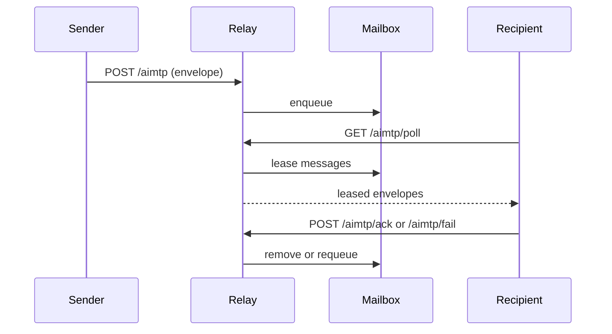

# System Architecture

## Overview
AIMTP separates **protocol semantics** (envelopes, messages, tasks) from
**transport** (HTTP, queues, files). The reference runtime provides an HTTP
relay and mailbox store, but the protocol can be embedded in other systems.

Key components:
- **Schemas**: JSON Schemas that define the envelope and message model
- **SDK**: helpers for building and validating envelopes
- **Relay**: HTTP interface for enqueueing and polling messages
- **Mailbox Store**: pluggable persistence (in-memory, SQLite, Redis)

## Message Flow


## Delivery Guarantees
- **At-least-once** delivery with explicit leasing
- Leases expire and are requeued with backoff
- Messages exceeding `AIMTP_MAILBOX_MAX_RETRIES` move to the dead-letter queue

## Storage Options
- **In-memory**: fast, ephemeral, for dev/test
- **SQLite**: durable, single-node persistence
- **Redis**: shared state for multi-instance deployments

## Scaling Guidance
- Run multiple relay instances behind a load balancer.
- Use Redis storage so all relays share mailbox state.
- Use `AIMTP_REDIS_KEY_PREFIX` to shard recipients across Redis databases.
- If you need fan-out notifications, integrate Redis Pub/Sub or streams
  externally. The relay does not require Pub/Sub to function.

## Multi-Relay Safety
- Relay instances use a per-recipient Redis lock so mailbox state transitions are serialized across instances.
- Lease state is shared in Redis; `ack` and `fail` are valid from any relay instance.
- Duplicate `ack`/`fail` calls for the same lease id are treated idempotently for a bounded TTL window.
- Lock acquisition is bounded by timeout to avoid permanent stalls after instance failures.

## Authentication and Signatures
AIMTP envelopes may include an optional chain-agnostic `signature` block
(`alg`, `kid`, `sig`, optional `created_at`, `expires_at`). The reference
runtime verifies signatures over canonicalized envelope bytes (top-level
`signature` removed, stable JSON key order, UTF-8) based on policy mode
(`off`, `warn`, `enforce`).

## AI Hooks (Data Model Only)
Phase 4 introduces optional AI hook fields for richer machine-readable context:
- `intent`: string (legacy) or structured object (`type`, `priority`, `deadline`, `requires_ack`, `tags`).
- `actions`: ordered action hints (`id`, `type`, `inputs`, optional constraints/result branches).
- `capabilities`: optional offered/required capability sets.
- `negotiation`: optional offer/counter/accept/reject metadata.

These fields are schema-level metadata only in v0.1:
- No new endpoints.
- No delivery guarantee changes.
- No blockchain or provider-specific behavior.
- Existing clients that only use string `intent` remain valid.

Example envelope-level hook payload:
```json
{
  "intent": {
    "type": "task.request",
    "priority": "high",
    "requires_ack": true,
    "tags": ["planning", "batch"]
  },
  "actions": [
    {
      "id": "act-1",
      "type": "invoke",
      "inputs": {"tool": "planner", "mode": "fast"}
    }
  ],
  "capabilities": {
    "required": ["planner.v1"],
    "offered": ["summarizer.v2"]
  },
  "negotiation": {
    "offer": {"max_latency_ms": 1500},
    "counter": {"max_latency_ms": 1000}
  }
}
```

## Protocol Surfaces
- **Spec**: `spec/aimtp-v0.1.md`
- **Schemas**: `schemas/`
- **Runtime**: `docs/runtime.md`
