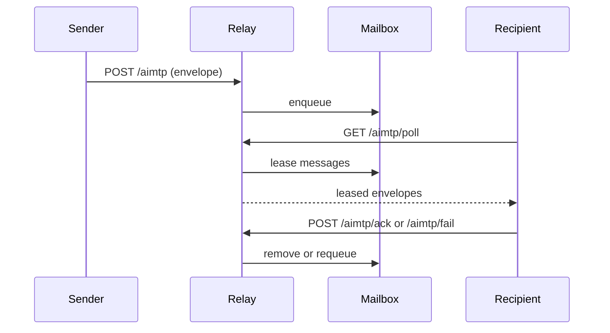

# System Architecture

## Overview
AIMTP separates **protocol semantics** (envelopes, messages, tasks) from
**transport** (HTTP, queues, files). The reference runtime provides an HTTP
relay and mailbox store, but the protocol can be embedded in other systems.

Key components:
- **Schemas**: JSON Schemas that define the envelope and message model
- **SDK**: helpers for building and validating envelopes
- **Relay**: HTTP interface for enqueueing and polling messages
- **Mailbox Store**: pluggable persistence (in-memory, SQLite, Redis)

## Message Flow

## Delivery Guarantees
- **At-least-once** delivery with explicit leasing
- Leases expire and are requeued with backoff
- Messages exceeding `AIMTP_MAILBOX_MAX_RETRIES` move to the dead-letter queue

## Storage Options
- **In-memory**: fast, ephemeral, for dev/test
- **SQLite**: durable, single-node persistence
- **Redis**: shared state for multi-instance deployments

## Scaling Guidance
- Run multiple relay instances behind a load balancer.
- Use Redis storage so all relays share mailbox state.
- Use `AIMTP_REDIS_KEY_PREFIX` to shard recipients across Redis databases.
- If you need fan-out notifications, integrate Redis Pub/Sub or streams
  externally. The relay does not require Pub/Sub to function.

## Authentication and Signatures
AIMTP envelopes may include an optional `signature` object with `key_id`,
`signature`, and `alg`. The protocol is chain-agnostic and does not mandate a
specific blockchain. Verification and key ownership checks are runtime-specific.

## Protocol Surfaces
- **Spec**: `/Users/solo446/Documents/AIMTP/spec/aimtp-v0.1.md`
- **Schemas**: `/Users/solo446/Documents/AIMTP/schemas/`
- **Runtime**: `/Users/solo446/Documents/AIMTP/docs/runtime.md`
