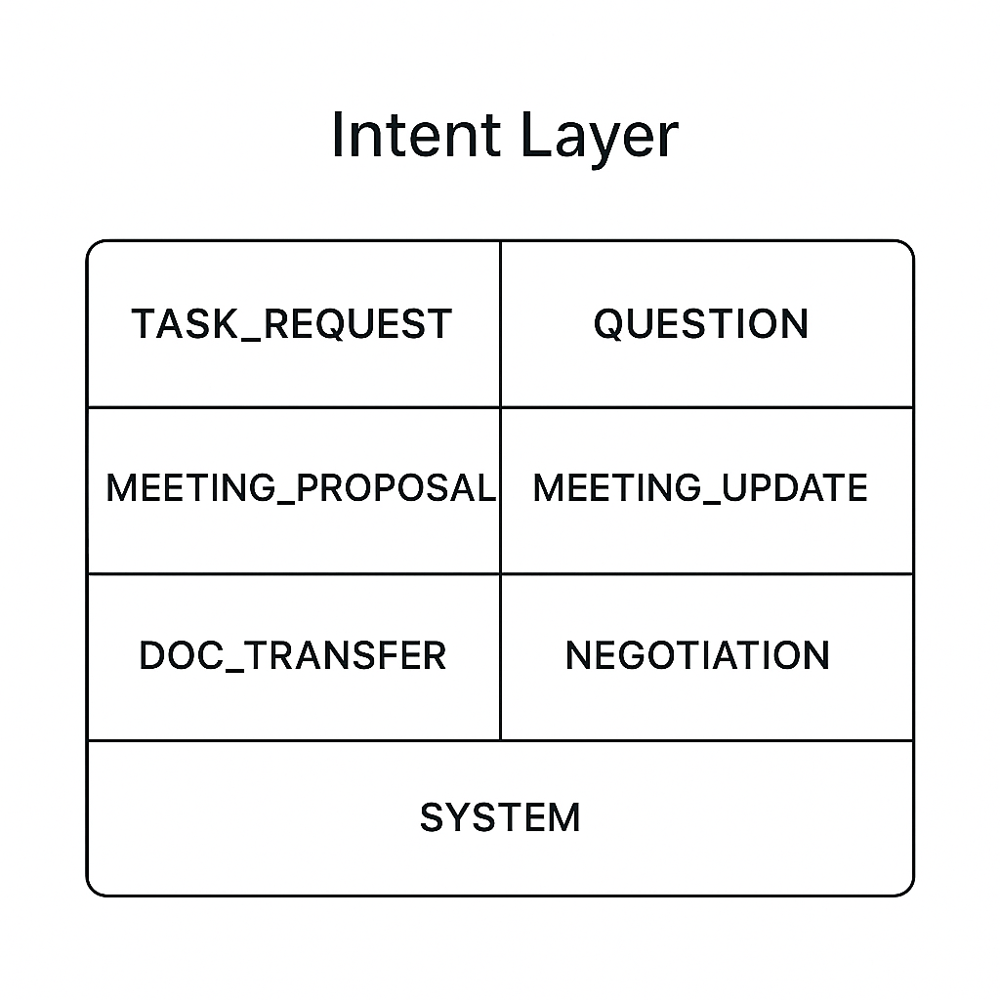
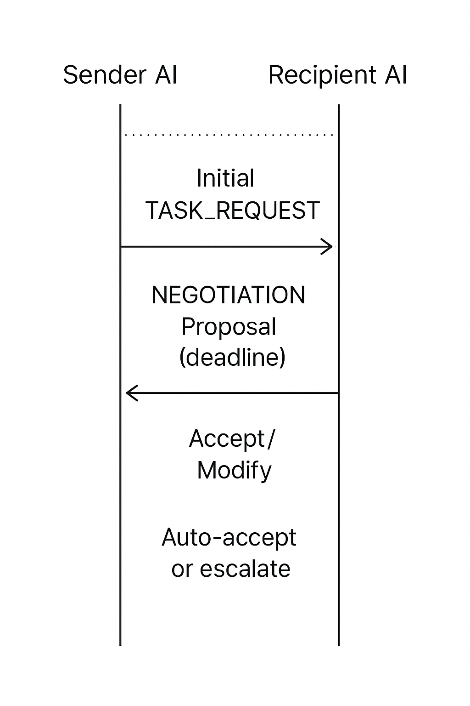
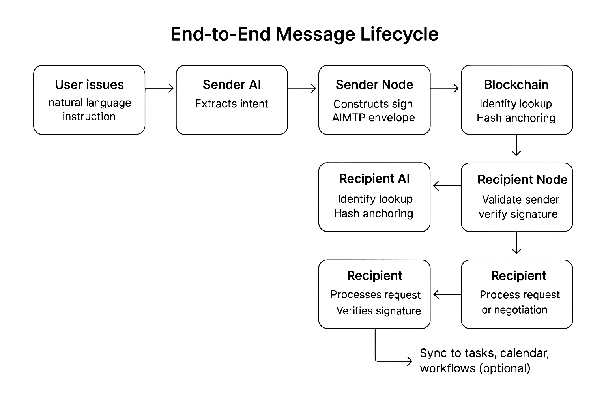
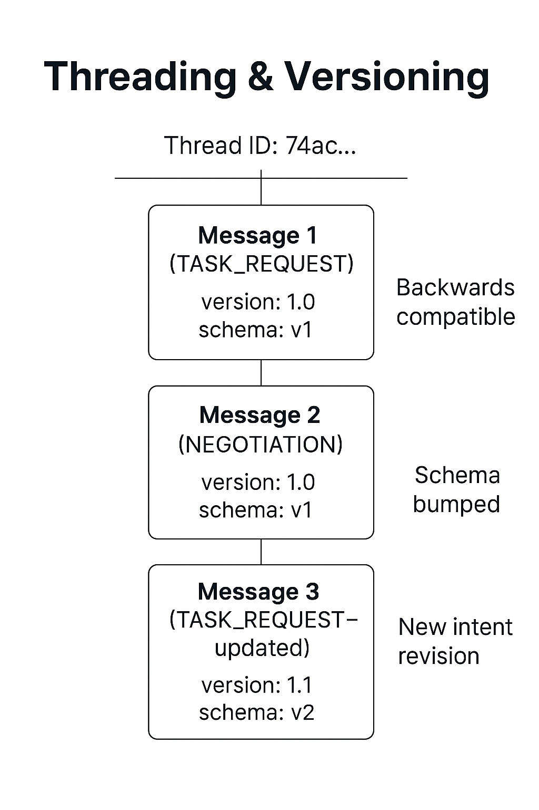

# Interoperability

AIMTP interoperability begins with a shared envelope, canonical signing bytes,
and predictable extension behavior. It is intended for interactions across
independent principals and implementation boundaries, not only for agents
inside one application.

## Adjacent protocols

These are divisions of responsibility, not competitive claims:

- **MCP roughly asks:** What tools and context can this model use?
- **AIMTP asks:** Who does this actor represent, what outcome is requested,
  what authority and constraints apply, and should the receiver trust and
  permit the interaction?
- **A2A focuses on:** agent discovery, communication, and task collaboration.
  AIMTP can complement or bridge that exchange with a trust/authorization
  envelope; it is not an A2A replacement.
- **HTTP and APIs provide:** transport and invocation. They can carry AIMTP or
  perform settlement after an AIMTP decision.
- **OAuth and PKI provide:** delegated-access and cryptographic building blocks.
  AIMTP may use or reference them rather than defining a replacement.

The reference HTTP relay is one transport profile. Conformance to the base
protocol does not require that relay or its mailbox endpoints.

## Interoperability contract

An `aimtp/0.1` implementation should:

1. Validate envelopes and messages against the normative schemas.
2. Preserve extension fields it does not interpret.
3. Produce canonical signing bytes identical to the committed vectors.
4. Separate schema validity, signature verification, trust, and authorization
   rather than treating them as one decision.
5. Make transport-specific delivery and settlement behavior explicit.

Run `npm run conformance` and see
[`tests/conformance/README.md`](../tests/conformance/README.md).

## Historical diagrams

The following diagrams predate the current Gateway and trust-envelope framing.
They are retained as historical explorations rather than normative architecture.

Intent

AI-to-AI Negotiation

Message Lifecycle

Threading

