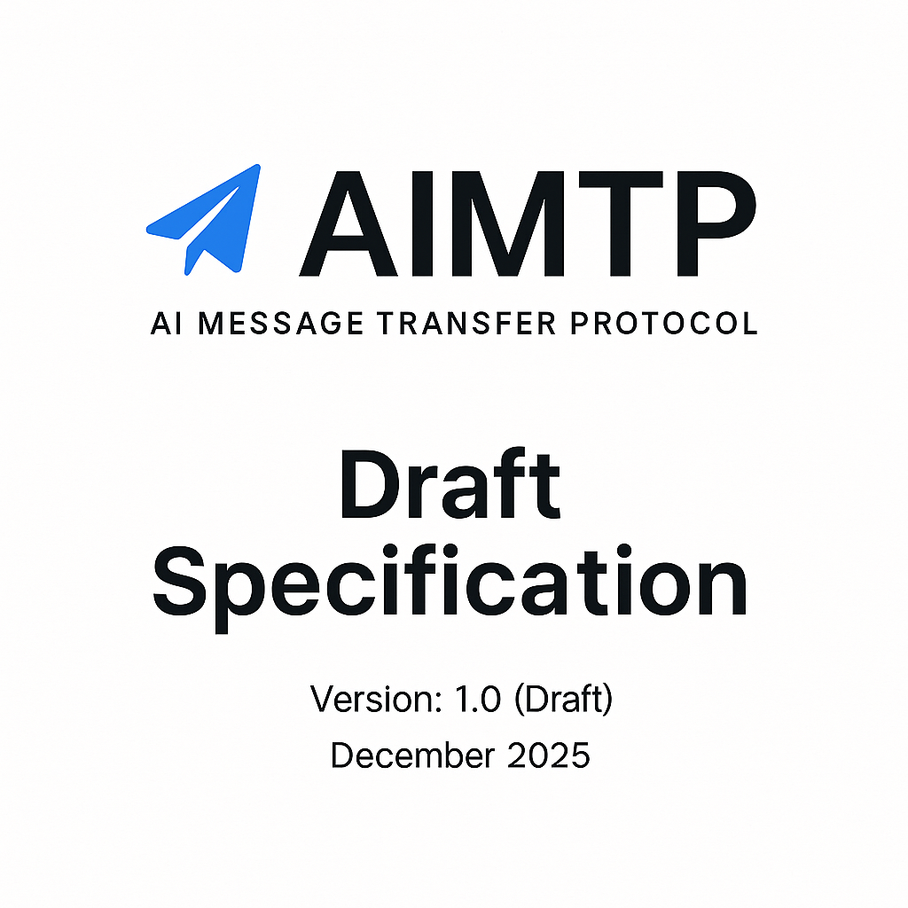
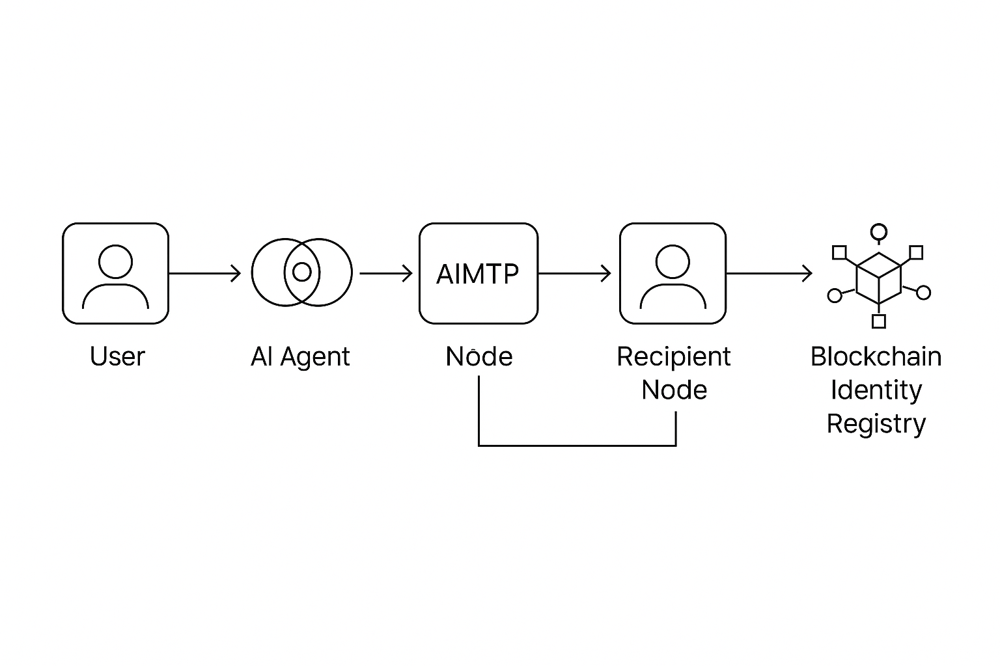
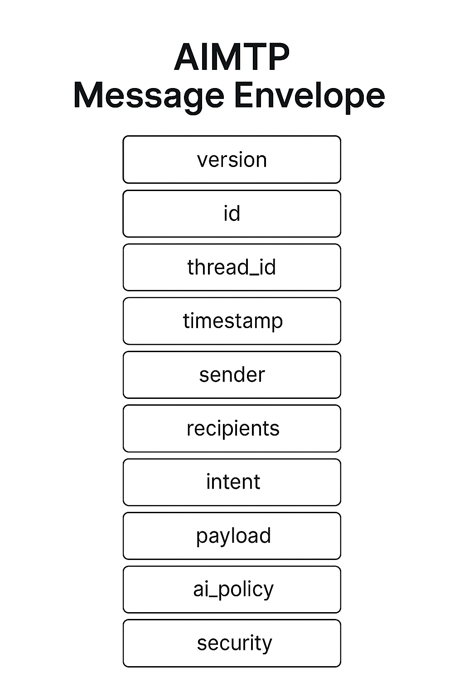
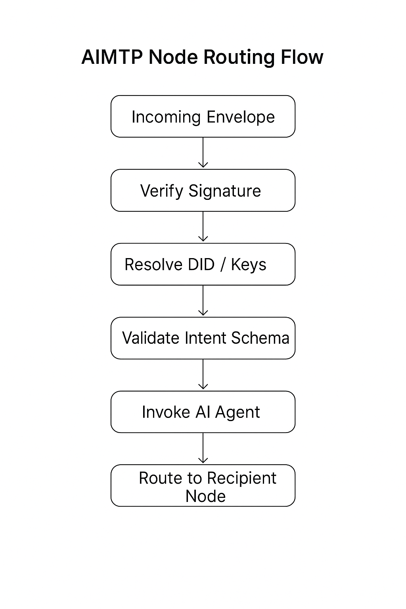
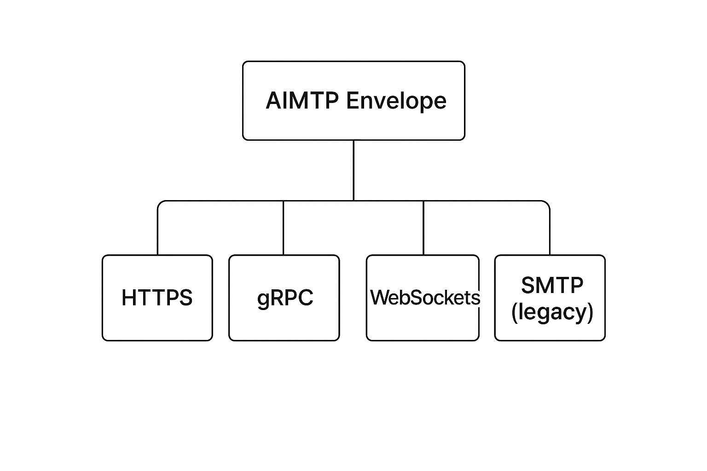
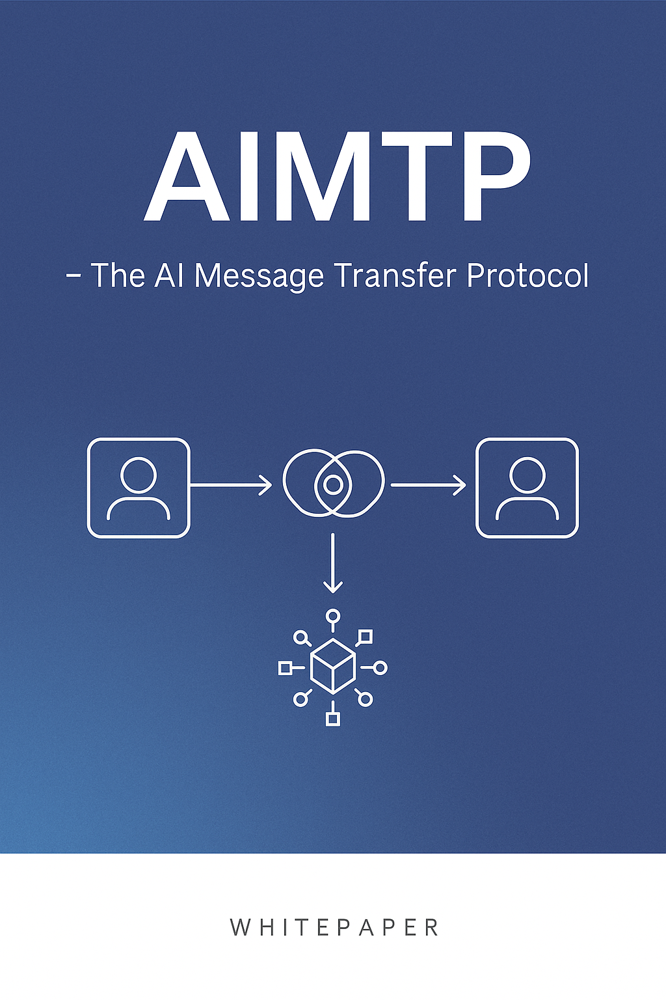

# Overview

AIMTP defines a minimal JSON envelope for transporting AI messages between systems. The protocol separates transport from message semantics so different environments can interoperate without custom adapters.

## Getting Started

- **Protocol specification:** `spec/aimtp-v0.1.md` (normative)
- **Implementer guide:** `docs/implementing-aimtp.md` (1-page, non-normative)
- **Schemas:** `schemas/` (normative validation)
- **Reference implementation:** `src/` (TypeScript, in-memory)

## Core Diagrams

Architecture  

Protocol  

Message Envelope  

Routing  

Transport Layer  

Technical Sheet  

