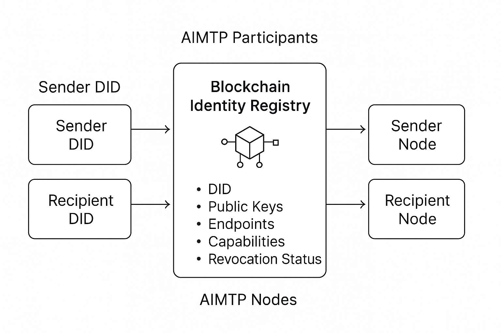
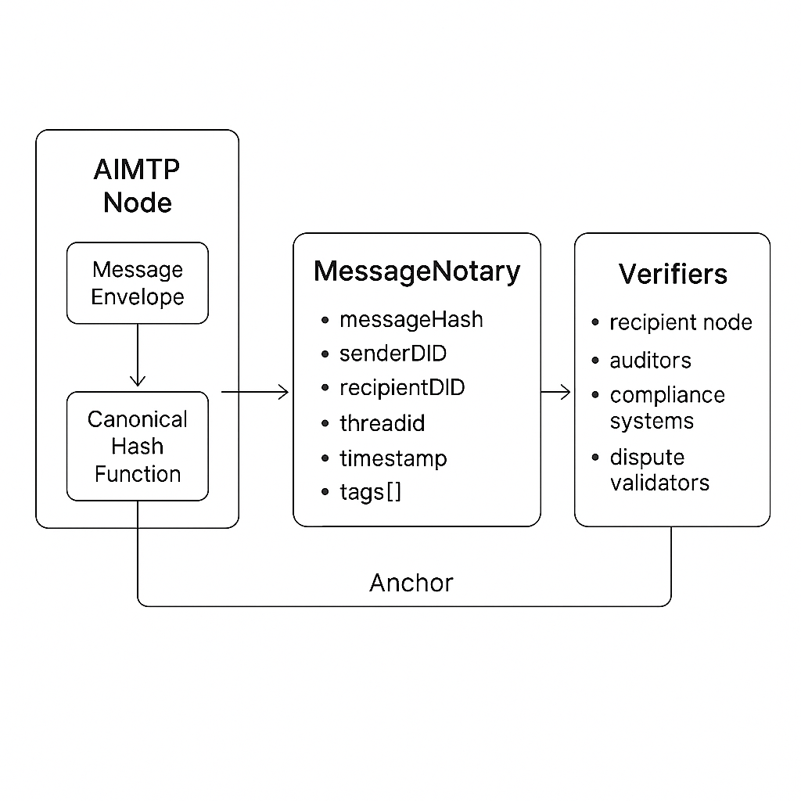
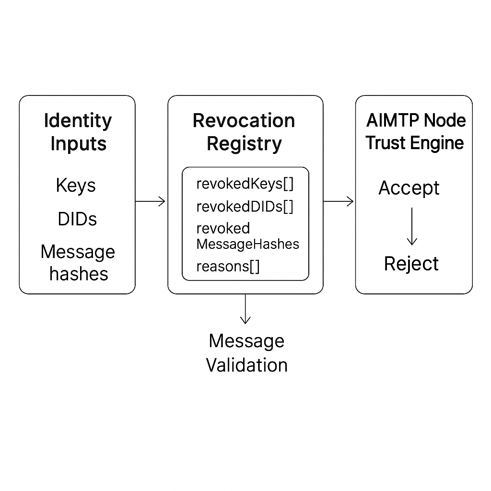

# Security

AIMTP is transport-agnostic and does not mandate a specific security model.
Implementations should provide confidentiality, integrity, and authentication
appropriate to their environment.

## Signatures (Chain-Agnostic)
AIMTP envelopes may include an optional `signature` object with:
- `alg`: algorithm identifier (for example `ed25519` or `secp256k1`)
- `kid`: key identifier
- `sig`: signature bytes (base64)
- `created_at`: optional RFC3339 signing timestamp
- `expires_at`: optional RFC3339 expiration timestamp

Backward-compatible aliases are supported:
- `key_id` alias for `kid`
- `signature` alias for `sig`

The protocol does not prescribe a blockchain or key format. Any cryptographic
verification or key ownership checks are handled by your runtime policy.

## Canonical Signing Payload
Signatures should be created over canonical envelope bytes:
- Remove top-level `signature` from the envelope.
- Serialize JSON with stable lexicographic key ordering at every object level.
- Preserve array ordering.
- Encode as UTF-8 with no extra whitespace.

## Diagrams (Conceptual)
These diagrams are conceptual and optional. They illustrate one possible
identity and anchoring approach but are not required by the protocol.

Identity

Anchoring

Revocation and Trust

